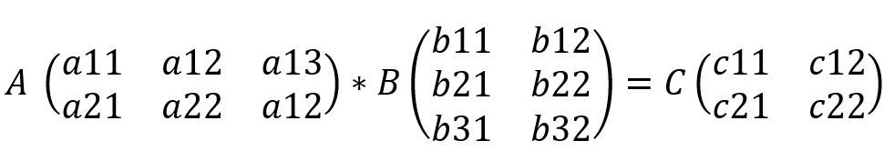
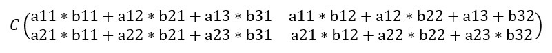
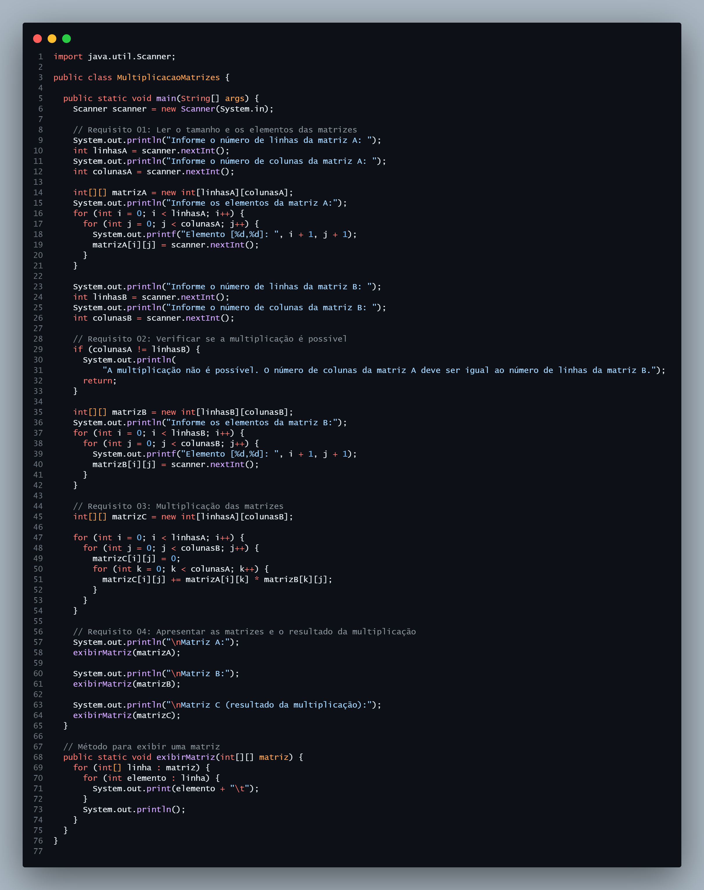
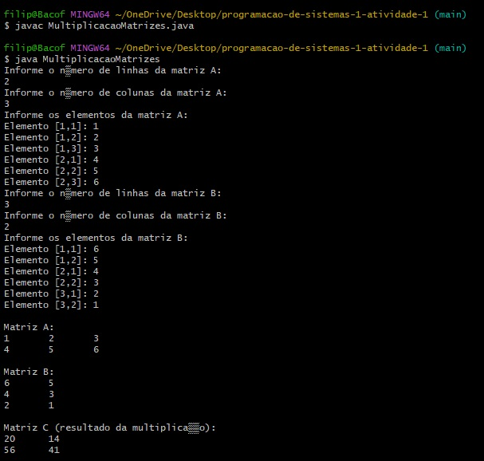
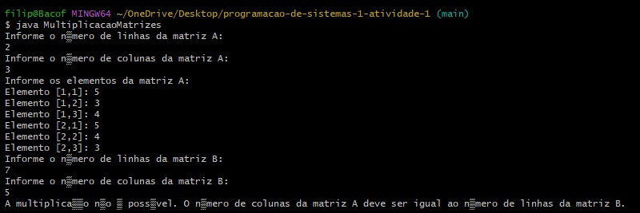
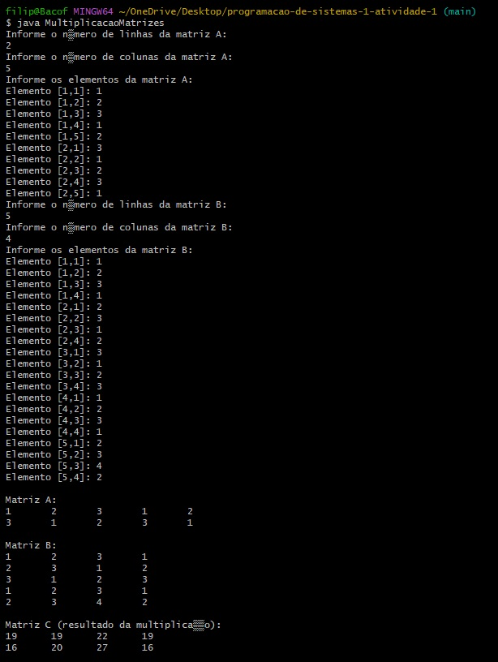

# Trabalho da Disciplina `Programação de Sistemas I`

[Ler Enunciado do exercício](/enunciado.md)

## Objetivo

O objetivo deste projeto é desenvolver um programa em Java que efetue a multiplicação de duas matrizes. O programa tem os seguintes requisitos:

1. Ler o tamanho e os elementos das matrizes;
2. Verificar se a multiplicação é possível;
3. Multiplicação das matrizes;
4. Apresentar as matrizes e o resultado da multiplicação.

## Como funciona a multiplicação de matrizes

- Ao multiplicar uma matriz "A" com 2 linhas e 3 colunas, por outra matriz "B" de 3 linhas e 2 colunas, o resultado sempre será uma terceira matriz "C" com o número de linhas de "A" e o número de colunas de "B".



- Os elementos de C são os resultados do somatório da multiplicação entre cada par de elementos da relação, como na imagem abaixo:



## Prints do Algoritmo

Aqui o print do código capturado usando o CodeSnap no VS Code:



### Primeira execução

Na primeira execução multipliquei duas matrizes simples, sendo a primeira matriz de 2x3 e a segunda matriz de 3x2, resultando uma matriz de 2x2



### Segunda execução

Na segunda execução temos um erro, onde não é possível efetuar a multiplicação, pois é necessário que o número de colunas da matriz "A" seja igual ao número de linhas da matriz "B"



### Terceira execução

Na terceira execução temos um cálculo mais complexo para validar o algoritmo. Temos a matriz "A" com 2 linhas e 5 colunas, e a matriz "B" com 5 linhas e 4 colunas. O resultado acaba sendo uma matriz de 2 linhas por 4 colunas.



#### Explicando a multiplicação da terceira execução:

- Matriz A:

```
1   2   3   1   2
3   1   2   3   1
```

- Matriz B:

```
1   2   3   1
2   3   1   2
3   1   2   3
1   2   3   1
2   3   4   2
```

- Para realizar a multiplicação de matrizes, o número de colunas da matriz A precisa ser igual ao número de linhas da matriz B, o que é verdade aqui: A tem 5 colunas e B tem 5 linhas.

- A matriz resultante (C) terá o número de linhas de A e o número de colunas de B, resultando em uma matriz de 2x4.

##### Passo a passo da multiplicação:

A multiplicação entre duas matrizes é feita pela soma dos produtos dos elementos de cada linha de A pelos elementos correspondentes de cada coluna de B.
Vamos fazer isso para cada elemento de C:

- Cálculo de `C[1,1]`:

```
C[1,1] = (1*1) + (2*2) + (3*3) + (1*1) + (2*2)
       = 1 + 4 + 9 + 1 + 4
       = 19
```

- Cálculo de `C[1,2]`:

```
C[1,2] = (1*2) + (2*3) + (3*1) + (1*2) + (2*3)
       = 2 + 6 + 3 + 2 + 6
       = 19
```

- Cálculo de `C[1,3]`:

```
C[1,3] = (1*3) + (2*1) + (3*2) + (1*3) + (2*4)
       = 3 + 2 + 6 + 3 + 8
       = 22
```

- Cálculo de `C[1,4]`:

```
C[1,4] = (1*1) + (2*2) + (3*3) + (1*1) + (2*2)
       = 1 + 4 + 9 + 1 + 4
       = 19
```

- Agora, vamos para a segunda linha de A:
- Cálculo de `C[2,1]`:

```
C[2,1] = (3*1) + (1*2) + (2*3) + (3*1) + (1*2)
       = 3 + 2 + 6 + 3 + 2
       = 16
```

- Cálculo de `C[2,2]`:

```
C[2,2] = (3*2) + (1*3) + (2*1) + (3*2) + (1*3)
       = 6 + 3 + 2 + 6 + 3
       = 20
```

- Cálculo de `C[2,3]`:

```
C[2,3] = (3*3) + (1*1) + (2*2) + (3*3) + (1*4)
       = 9 + 1 + 4 + 9 + 4
       = 27
```

- Cálculo de `C[2,4]`:

```
C[2,4] = (3*1) + (1*2) + (2*3) + (3*1) + (1*2)
       = 3 + 2 + 6 + 3 + 2
       = 16
```

Matriz C (Resultado final):

```
19  19  22  19
16  20  27  16
```
